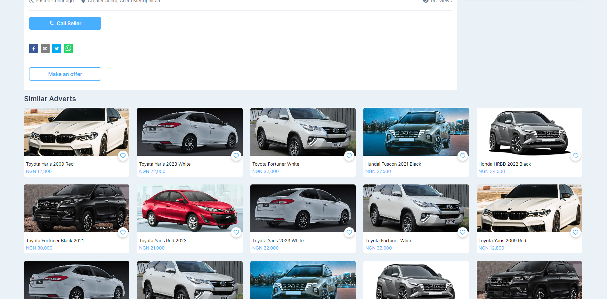

# Nesmaspoint Online Marketplace

Nesmaspoint is an online marketplace where users can upload their
products for sale, categorized into various sections such as vehicles,
fashion, toys, clothes, phones, and more. Users have the option to
enhance their product visibility by opting for premium plans, boosting
their ads for a specified duration (10, 20, 30 days), and enjoying
additional benefits.

- [Find me on fiver ](https://www.fiverr.com/zainbinramzan/develop-web-applications-with-mern-stack-react-node-express-moongodbplugin-react/README.md)
- [Find me on linkedin](https://www.linkedin.com/in/abu-zain-html-css-javascipt-developer/)

## Features

- **Product Categories:** Easily list and find products in different
  categories.
- **Boosted Ads:** Users can pay to boost their ads for increased
  visibility.
- **Premium Plans:** Unlock additional benefits with premium plans.
- **User Controls:** Delete, report, and manage your own ads.

## Tech Stack

- **Frontend:** Developed using React and Next.js.
- **State Management:** Redux Toolkit and Redux Thunk.
- **Backend:** Built with Node.js and Express.
- **Database:** MongoDB.
- **HTTP Requests:** Axios.

## Team Collaboration

This project was a collaboration between two individuals:

- Frontend-Developer:
[Abu Zain](https://www.linkedin.com/in/abu-zain-html-css-javascipt-developer/)
<!-- - ignore-pretier -->
- Backend-Developer:
  [Faizan Ashiq](https://www.linkedin.com/in/faizan-ashiq/)

## Roles and Permissions

- **User:** Can upload, manage, and delete their own ads.
- **Manager:** Manages and views ads, can delete ads.
- **Admin:** Creates new managers, deletes users, manages individual
  ads, approves pending ads, and views reports.

## Project Structure

The project structure is inspired by the Daraz app.

## Getting Started

1. Clone the repository.
2. Install dependencies using `npm install`.
3. Run the development server with `npm run dev`.

##### If you want to learn react, React router dom, hooks, node, express, mongoodb or you are looking for a fullstack project where you can learn how all the pieces are fit together then you are at right place
